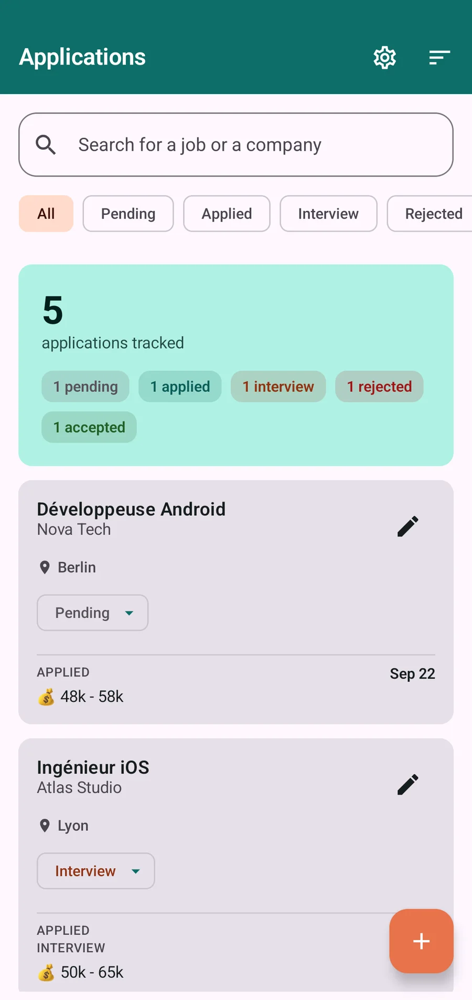
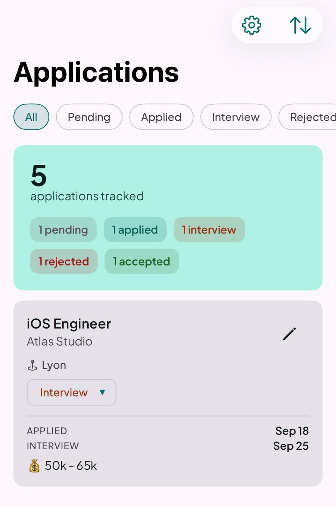
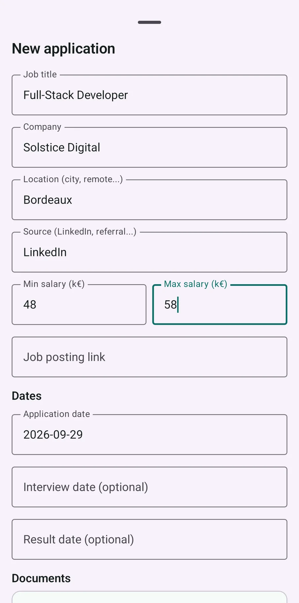
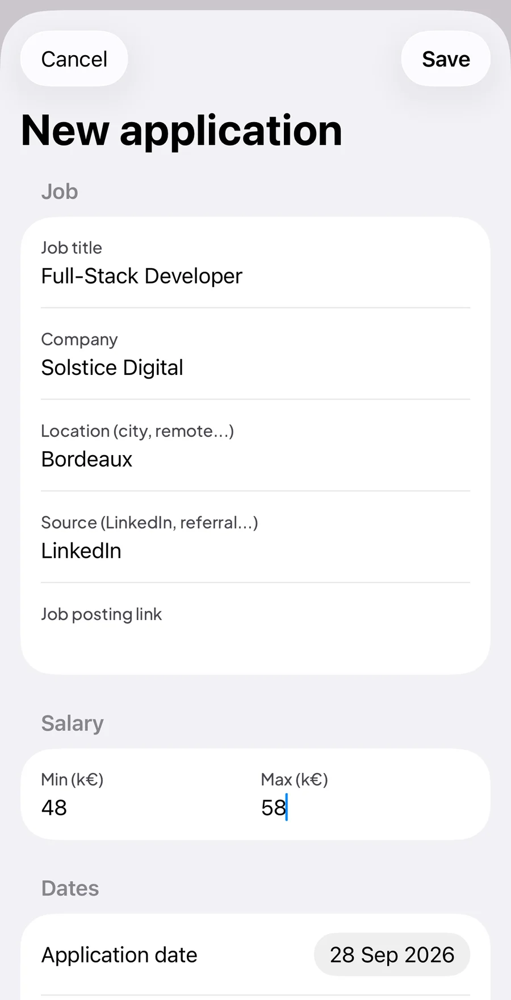
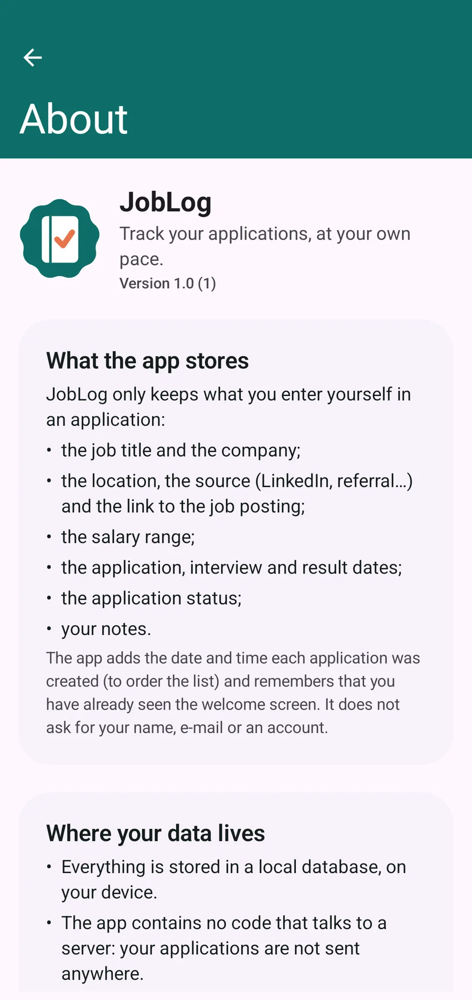
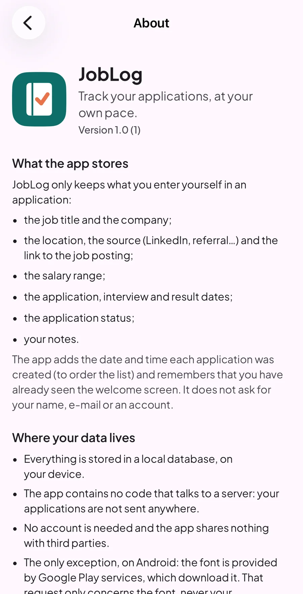

# JobLog

JobLog is a job application tracker: add every application you're pursuing, follow its status
from pending to accepted or rejected, and see your progress at a glance — with a fully native UI
on both Android and iOS, and no server, no account and no tracking.

## Screenshots

| | Android | iOS |
|---|---|---|
| **List** |  |  |
| **Add application** |  |  |
| **About** |  |  |

*(Sample data, never a real company. These screenshots will need to be regenerated if the UI they show changes.)*

## Features

- **Track applications** — title, company, location, source, salary range, application/interview/
  result dates, notes.
- **Statuses** — Pending, Applied, Interview, Accepted, Rejected, changeable in one tap from each
  card.
- **Search, sort and filter** — search by title/company, sort by date or alphabetically, and
  filter the list by one or several statuses at once.
- **Stats summary** — a card at the top of the list counts every application by status.
- **Onboarding** — a short 3-page walkthrough on first launch, illustrated with real screenshots
  of the app.
- **About / Privacy / Settings** — what the app stores, your rights over your data, a one-tap
  "delete everything", and a privacy policy screen.

All data stays **on the device**, in a local database. Nothing is sent to a server.

## Tech stack

- **Kotlin Multiplatform** (Kotlin 2.4.20) for the shared business logic, compiled to a JVM
  target for Android and a static framework for iOS.
- **Native UI on both platforms** — [Jetpack Compose](https://developer.android.com/jetpack/compose)
  (Material 3) on Android, [SwiftUI](https://developer.apple.com/xcode/swiftui/) on iOS. No
  Compose Multiplatform UI, no cross-platform UI framework.
- **[Room](https://developer.android.com/kmp/room)** (2.8.5, KMP) over SQLite for local
  persistence, including on iOS (via `BundledSQLiteDriver`).
- **[Koin](https://insert-koin.io/)** (4.2.2) for dependency injection, shared between both
  platforms.
- **[KMP-NativeCoroutines](https://github.com/rickclephas/KMP-NativeCoroutines)** to expose
  Kotlin `Flow`/`StateFlow` to Swift as `async`/`AsyncSequence`.
- **[multiplatform-settings](https://github.com/russhwolf/multiplatform-settings)** for small
  key-value state (e.g. "onboarding completed"), backed by `SharedPreferences` on Android and
  `NSUserDefaults` on iOS.
- **kotlinx-datetime** for shared date handling.
- Tests: `kotlin.test` + JUnit 4 (Android/JVM and Kotlin/Native), XCTest (iOS).

## Architecture

Three Gradle modules:

| Module | Role |
|---|---|
| `sharedLogic` | Kotlin Multiplatform module: domain models, use cases, Room database, repositories, view models, Koin modules, and platform-agnostic content shared by both UIs. |
| `androidApp` | The Android app (Jetpack Compose), consuming `sharedLogic` directly as a Kotlin dependency. |
| `iosApp` | The iOS app (SwiftUI), consuming `sharedLogic` as a compiled `SharedLogic.framework`. |

`sharedLogic` is organized in layers: `domain` (models, repository interfaces, use cases) →
`data` (Room entities/DAOs/migrations, repository implementations) → `presentation` (view models,
UI state, and shared "content" objects) → `di` (Koin modules).

**Shared content, native rendering.** Screens whose text and rules are identical on both
platforms (About, Privacy Policy, Settings, Onboarding) don't have their copy duplicated in two
UI codebases. Each one has a single Kotlin class in `sharedLogic` (e.g. `AboutContent`,
`PrivacyContent`, `SettingsContent`, `OnboardingContent`) that exposes the exact strings and
simple layout data (sections, bullet points, navigation rules) for the requested language. The
Android screen and the SwiftUI view each read that same object and only handle how it's drawn —
so the two platforms can never silently drift apart on wording or behavior.

The main `JobOfferListViewModel` lives in `sharedLogic` as plain Kotlin (no
`androidx.lifecycle.ViewModel`), so it can be instantiated once and shared between the splash
screen and the list on both platforms. Android reads its `StateFlow` with
`collectAsState()`; iOS bridges it to an `ObservableObject` via KMP-NativeCoroutines.

## CI/CD

- **CI** (`.github/workflows/ci.yml`) runs on every push/PR to `dev`: two independent jobs, one
  running the Android/JVM unit tests, one running the shared module's native tests plus the iOS
  XCTest suite on a simulator. No build artifact is produced, no secret is used.
- **CD** (`.github/workflows/cd-android-staging.yml`) runs on every push to `staging`: builds a
  signed `.staging` Android APK and uploads it to Firebase App Distribution for internal testers.

## Building and testing locally

```bash
# All Kotlin tests (Android/JVM unit tests + shared module, including native iOS tests)
./gradlew allUnitTests

# Android app only
./gradlew :androidApp:assembleDebug
./gradlew :androidApp:testDebugUnitTest

# iOS: open iosApp/iosApp.xcodeproj in Xcode and run the `iosApp` scheme, or from the CLI:
xcodebuild test -project iosApp/iosApp.xcodeproj -scheme iosAppTests \
  -destination 'platform=iOS Simulator,name=<simulator name>'
```

Xcode builds trigger `:sharedLogic:embedAndSignAppleFrameworkForXcode` automatically to (re)build
the Kotlin framework before compiling Swift code.
